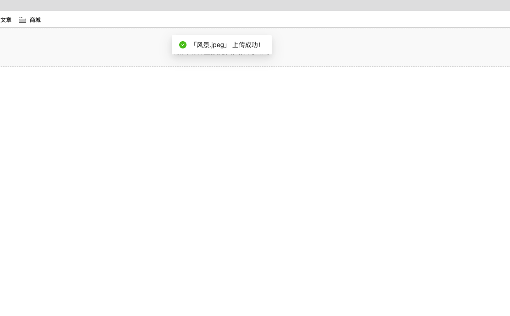

### 一、功能描述
以下功能实现，无开发经验也可轻松实现。通过共享域名（注册后就自动分配一个域名，无需购买）或自定义域名（需要购买并备案）访问网站，网站有上传文件的按钮或者可以拖拽文件到网页。文件选择成功后，就自动进行文件上传保存在云服务器中。当需要下载文件时，可以直接登录云服务后台进行下载。功能类似简易的百度网盘，优点是上传文件，下载文件更便捷更快没有速度限制。

### 二、开发前准备工作
2.1、注册 [LeanCloud](https://www.leancloud.cn/) 平台，创建应用
注册 LeanCloud 平台时，直接选择个人就可以，创建应用选择华东或者华北均可以，然后随便填写一个应用名称，和应用描述，然后选择开发版（免费）。

2.2、开通数据存储功能
点击上面步骤创建的应用，然后点击**数据存储，点击文件，点击上传，**随便选择一个文件进行提交成功后就可以开通文件存储的功能！
### 三、Web应用部署到云引擎
项目压缩包下载地址：[点击下载](http://cdn.weijiash.cn/q9fbAVRvDMgLrEWk4LiIxyP5faKl8op1/resoouer_save.zip)
#### 有Web开发经验：
如果有 Web 开发经验的同学可以直接下载这个项目，然后修改其中的App.js文件中的appid、appkey、serverURL的值；
这三个值为LeanCloud后台点击设置，点击应用凭证：

然后将下载的React项目进行构建，构建成功后，按照如下方法进行部署。

1、先安装命令行工具
2、登录云服务器 ，命令如下：
`lean login`
3、本地项目与LeanCloud项目关联，命令如下：
先进入项目根目录  `cd /项目路径`
然后进行关联： `lean switch`
3、开始部署
`lean deploy`
部署成功后，可以通过这里的链接直接复制到浏览器访问就可以了：

#### 无开发经验：
如果没有开发经验的同学，直接注册平台获取到appid等信息后，可以直接评论或留言私我，我可以远程协助你，因为很简单，耽误不了多少时间；**（放心我是无偿的）**
